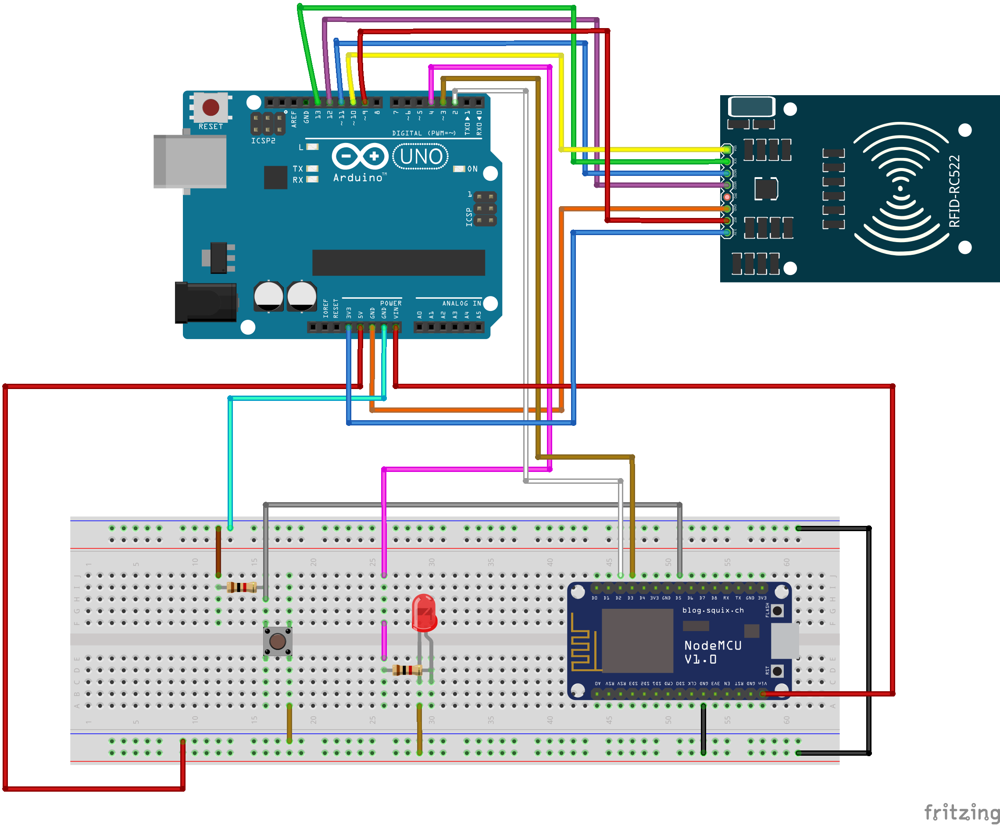

# SMART CITY - RFID BASED TICKETING SYSTEM

 

Developed By:

* [S C Arham](https://www.github.com/arhamsc) - arhamscoff@gmail.com
* [S Sagar](https://github.com/sagar6250)

## Description

This project is created to better the common problem of manual ticketing in Bus Transportation. Smart Cities are those which make the efficiency and utilization of technology maximum so in aid for that this automatic ticketing system helps in automated ticket issue and payment.

## Steps to run

1. Start the ESP8266 Module:

> i. Check if APConnect is available in WiFi (this means that ESP is not connected to wifi)
>
> > * If not available
> >
> > * Connect to APConnect and go to 192.168.4.1 and connect to desired Wifi
> >
> > * Press the button on breadboard to check the connected IP address of ESP
> >
> ii. Change `IP` address in the `handleGetDataFromAPI()` and `handlePostDataToAPI()` to current system's IP which is running the node server (started in next step)
>
> iii. Build the code and upload to ESP8266 (Make sure platform.io project is appropriately selected)

2. Start Arduino Uno:

> i. Build and upload the code to arduino uno.
>
> ii. Make sure the circuit is properly interfaced with RFID module.
>
> iii. To check, scan the RFID tag and it should print the email stored in the card to the Serial.

3. Start NPM server (API):

> i. Run `npm i`
>
> ii. In .env file change the ESP IP to the IP obtained from step 1.i
>
> iii. Run `npm run dev`
>
> iv. Run `prisma studio`

## Workflow

### Ticket Reading

* Scan the card.
* Arduino interfaced with RFID will read the block contents which is user email.
* This email is printed to Serial and sent to ESP8266.
* ESP8266 sends POST request to API Node Server with required details.
* Server responds with OK and creates a Database Entry which can be viewed in prisma studio.

### Writing to card

* With user id of the person that has to be registered with the card in the request body, make a POST request to /write-to-card endpoint of API.
* API then fetches the user details from the database and sends the POST request to the ESP8266 server with email as request body.
* ESP9266 will extract the request body and user's email and sends it to arduino
* Arduino will write the email onto the card. (Note: Until the card is scanned after the write request the flow of the program will be halted.)

## Circuit Diagram

___Note : Open Diagram.fzz in frietzing to view the diagram in breadboard___
